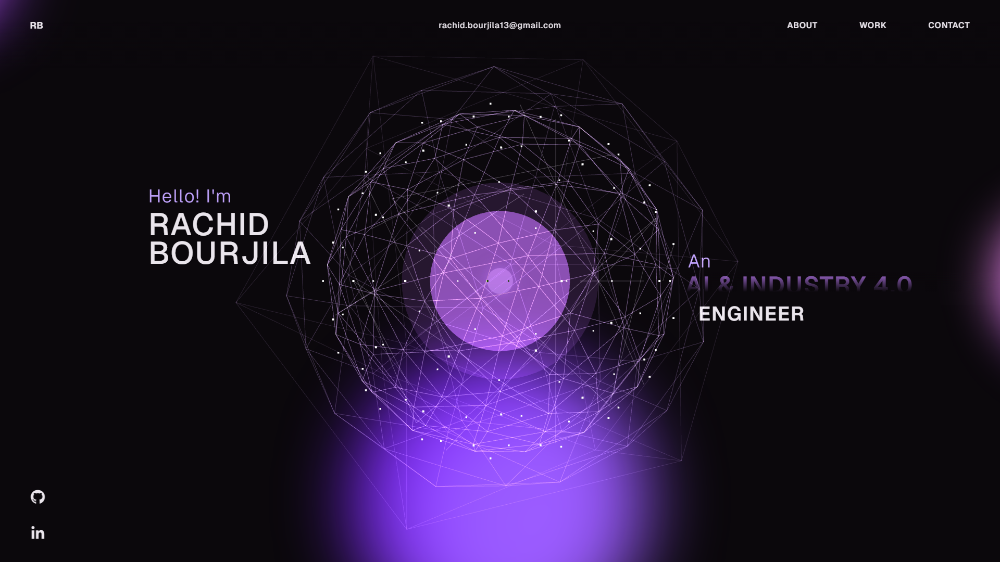

# 🚀 Rachid Bourjila — Portfolio (React + TypeScript + Three.js)

[](https://rachid-bourjila-portfolio.vercel.app)

A modern, high-performance **3D personal portfolio website** built with **React**, **TypeScript**, **Three.js**, **GSAP**, and **WebGL**.

> Live: [rachid-bourjila-portfolio.vercel.app](https://rachid-bourjila-portfolio.vercel.app)

---

## ✨ Highlights

- **3D / WebGL experience** powered by **Three.js**
- Smooth animations with **GSAP**
- Modern **React + TypeScript** codebase
- Fast, responsive UI (desktop + mobile)
- Real projects, real experience, kept up to date as new work ships

---

## 🧰 Tech Stack

- **React**
- **TypeScript**
- **Three.js / WebGL**
- **GSAP**
- **HTML / CSS / JavaScript**

---

## 🚀 Getting Started

### 1) Clone

```bash
git clone https://github.com/rachidbr6/portfolio-website.git
cd portfolio-website
```

### 2) Install

```bash
npm install
```

### 3) Run locally

```bash
npm run dev
```

### 4) Build

```bash
npm run build
```

---

## 🤝 Connect

- LinkedIn: https://www.linkedin.com/in/rachid-b-936085294/
- GitHub: https://github.com/rachidbr6

---

## 🪪 License

This project is open source and available under the **MIT License**. See [LICENSE](LICENSE).
